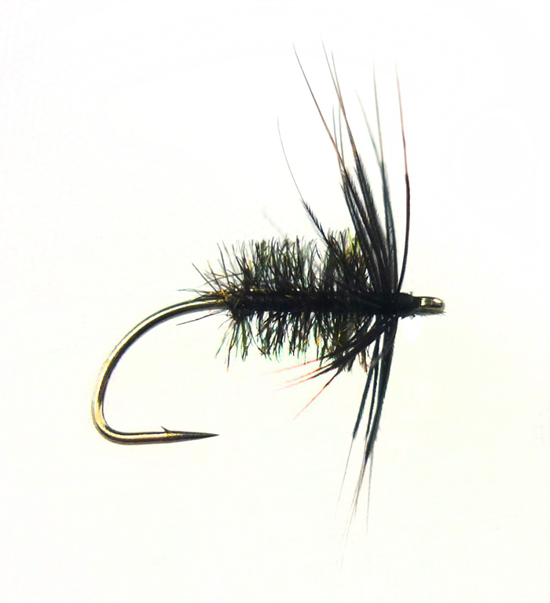
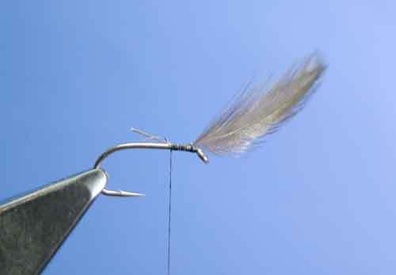
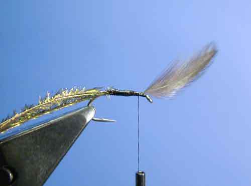
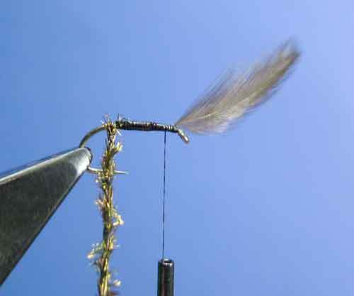
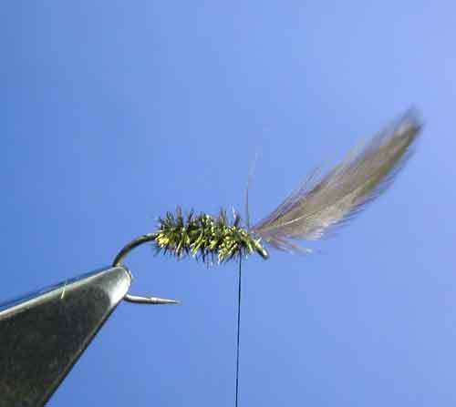
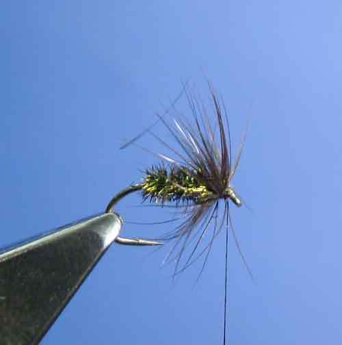
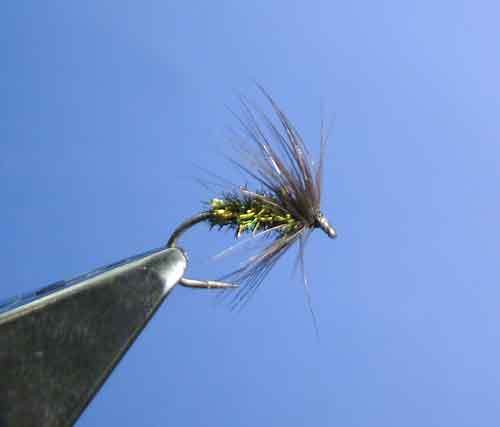

# The Black and Peacock Spider

## Introduction

This is the Black and Peacock Spider.

A deadly fly at times and easy to tie.

## Where to fish

.

## When to fish

.

## How to fish

.

## How to tie

What you will need.\:

- Vice.

- Bobbin.

- Sharp scissors.

- Whip finish tool.

- Hook: Wet Fly, #10-16.

- Thread: Black, 8/0.

- Hackle: Black Hen.

- Rib: Fine Gold or Copper Wire.

- Body: Peacock Herl.

- Cement: .

### Tying tip

.

### Tying the fly

Attach the thread and make two turns of thread, then tie in the hackle.

If you struggle with only two turns of thread before the hackle, simply increase to three or four turns.

Wind the thread to the hook bend, catching in the ribbing wire and the Herl for the body as you go.

I have used four herls here for the size of hook I’m using (#12).

Use more or less depending on the size of the hook.

Twist the Herl and the wire together to make a rope.

Then wrap to form the body.

ie of at the shoulder and trim the waste.

If you wish you can varnish the body before wrapping the Herl.

Wrap the hackle and tie off.

Form a neat head and whip finish for the completed fly.
