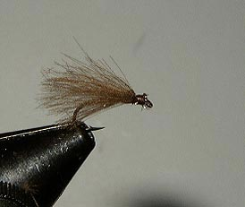
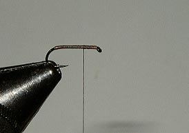
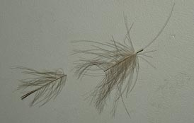
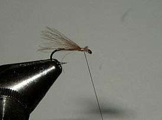

# The CDC Sedge Fly.

## Introduction

## Where to fish

.

## When to fish

.

## How to fish

.

## How to tie

What you will need:

- Vice.

- Bobbin.

- Sharp scissors.

- Whip finish tool.

- Hook: Size 10-20 dry fly.

- Thread: Brown.

- Body: Brown Thread.

- Wing: Brown or Gray CDC.

### Tying tip

.

### Tying the fly

Catch the thread onto the hook shank.

Wind the thread in touching turns to the bend and back to form a body.

Take a CDC feather, stroke the fibres against the natural direction and cut the tip of the feather as shown above.

Stroke the fibres back and tie them in such manner that the shaft is not tied in.

Repeat until you have a full wing.

Tie off with a Whip finish knot, cut the thread and fix the knot with cement.

Pinch, if wanted, the barb with a plier.
