# The Devaux Sedge (variant) Fly

Originator: murtol.

Source: http://ukflydressing.proboards.com.

## Introduction

This fly was designed to sit down into the surface film, representing an egg laying or spent sedge.

The wing on the original was tied differently, with the two side feathers tied in first, then the third tied in over and then all three were varnished.

I have varnished the three feathers first, left to dry and then tied in, I believe that this makes the fly more durable, having the feathers independent of each other allows them more movement should, hopefully, a fish take it.

## Where to fish

.

## When to fish

Also, as it is primarily fished when getting dark and its the silhouette that is important some tiers don't bother with a body at all, here I have, it doesn't take too long to dub a hook shank.

It's a pretty simple pattern to tie, and can be very effective in the evening and at dusk.

## How to fish

.

## How to tie

### What you will need

- Vice.

- Bobbin.

- Sharp scissors.

- Whip finish tool.

- Hook: Kamasan B170 #12 - 16.

- Thread: Black Benecchi 8/0.

- Body: 70% Olive Seals Fur & 30% Olive SLF, (optional - colour to suit or none at all).

- wing: Three Mallard Breast Feathers, Varnished.

- Hackle: Brown Cock.

- Head: tying thread.

- Cement: .

### Tying tip

.

### Tying the fly

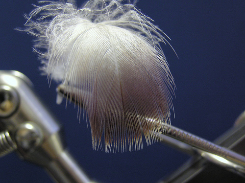

Take three mallard breast feathers, pictured above.

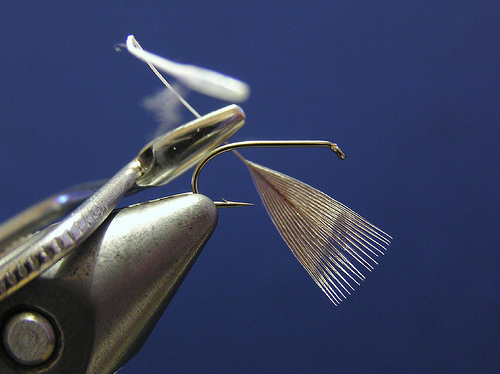

Strip the fibres from the feather leaving roughly 1.5x hook on at the tip.

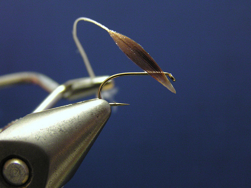

Place a few drops of clear varnish on your index finger and thumb, the pull the feather between
them a few times, and leave to dry, the feather should turn out like the one in the picture below.
Repeat this with the other two feathers.

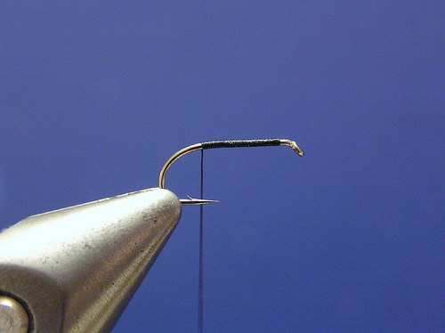

Mount the hook, attach the thread and run to the bend.

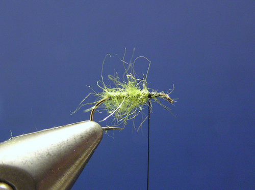

Dub the body two thirds of the shank length.

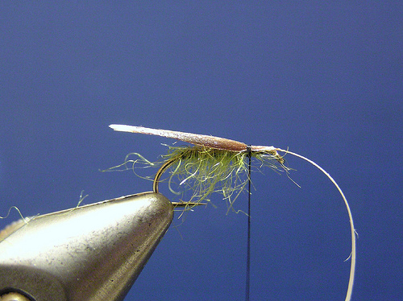

Catch in the first wing feather on top of the shank just above where the last fibres meet the quill
of the feather, this will curve the wing slightly around the body.

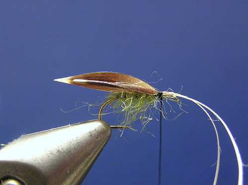

Catch in the second wing on the far side of the shank, where the last fibres meet the quill of the feather.

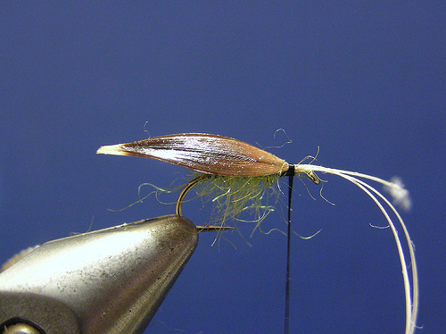

Do the same for the last wing feather on the near side of the hook.

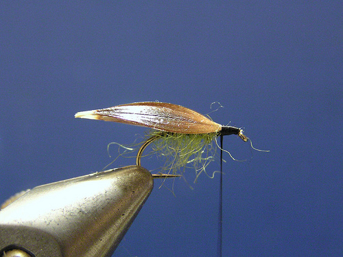

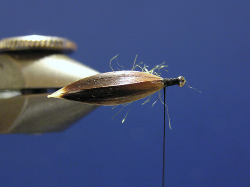

Adjust the wing feathers to get them properly in position so they form a tent shape over the hook,
the tie down with tight wraps over the quills and trim the waste.

Tie in a brown cock hackle.

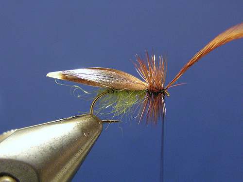

Wind the hackle to the eye and tie off.

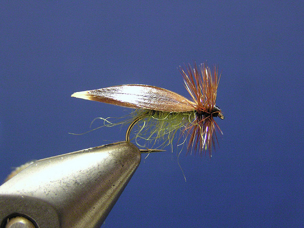

Trim the waste, whip finish and varnish.
