# The Genner Bug Fly

Originator: Martin Joergensen.

Source: Global Fly Fisher.

## Introduction

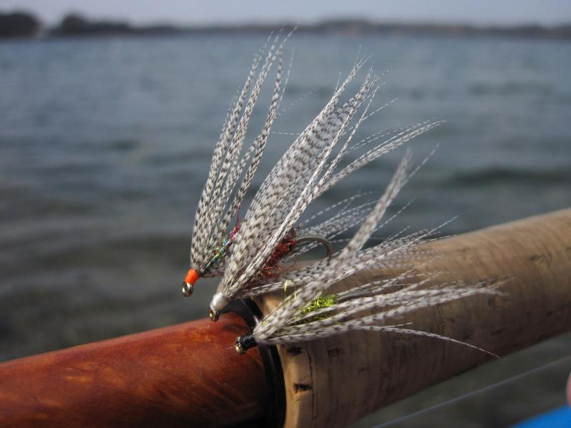

The name of this fly comes from the name of its birthplace, Genner Bugt or Genner Bay, in the southern part of Denmark.

It was obvious to just shorten the name to become a bug.

There's absolute nothing original or innovative about it.

On the contrary: it's super simple and has probably been tied in a gazillion variations before.

Actually, when I posted a picture of it on our common internal web site where we put in all our trip reports and images, another good friend and GFF contributor, Ken Bonde Larsen, immediately commented that he had seen this fly on the web just days before.

No, when in comes to fly tying as so much else, there isn't much new under the sun.

!Fish](fish.jpg)

Nevertheless this fly was invented, uninspired by anything I had seen, during a nights fly tying session after a fishing day at exactly Genner Bay.

A good steak dinner, wine, coffee and a Tallisker or two, set the fantasy off, and the beautiful mallard feathers that Paul brought had to be used for something.

I remembered the Kevin Kleinman's Double K Reverse Spider, a radically different fly, sporting a dubbed body and a couple of forward pointing hackles, one of them mallard, and thought I'd do something as simple but a little more streamlined.

I always loved mallard feathers, and Paul's stock of large and regular feathers called out for something with a long and sweeping hackle.

So hook in the vise, a little weight, dubbing and a hackle, and voila !

I actually liked what I saw.

A few more tied with different colors of dubbing and thread, and I had a whole collection.

The next day I was fishing from the beach casting over a deep part of Genner Bay, and lo and behold !

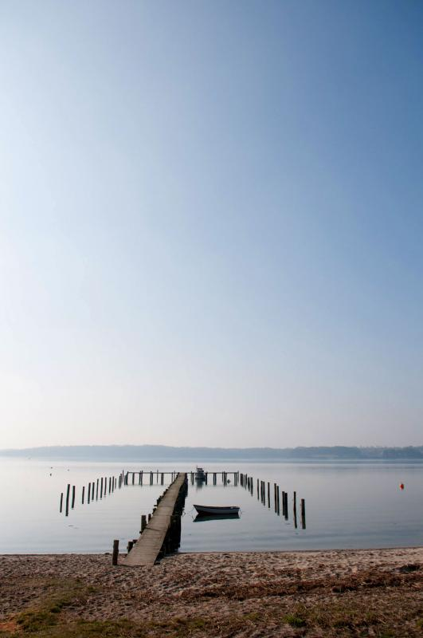

A fish liked the green variation, and the fly was baptized.

As I said: nothing that will shatter the fly tying community and nothing that will go down in history as a classic, but a fly that I have already produced more of and will happily tie on my tippet on many coming coastal trips.

I have done a number of variations with different colors, and keeping the natural mallard and varying the thread and dubbing gives you an endless but very simple way of subtly changing the appearance of this fly.

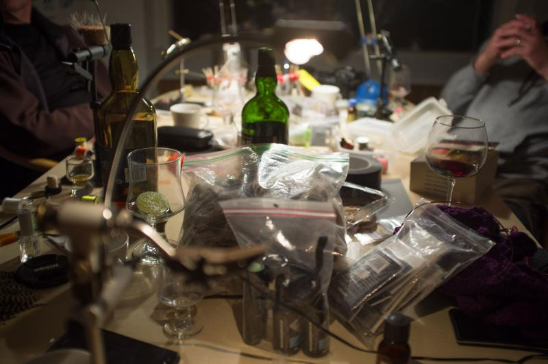

## Where to fish

.

## When to fish

.

## How to fish

.

## How to tie

### What you will need

- Vice.

- Bobbin.

- Sharp scissors.

- Whip finish tool.

- Hook: Stinger hook size 8-10-12.

- Weight: Heavy wire, lead substitute.

- Thread: 8/0 to suit dubbing (or simply black).

- Body: Flash dubbing (green, red, copper, peacock or what color suits you).

- Hackle: Natural mallard, long fibers.

- Head: tying thread.

- Cement: .

### Tying tip

.

### Tying the fly

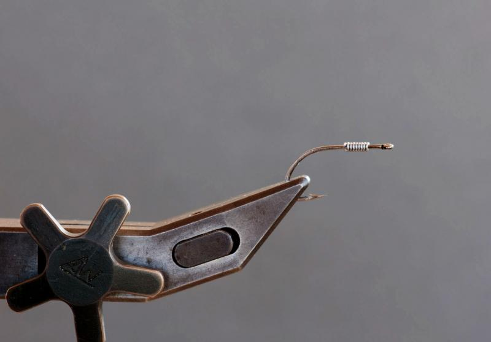

Add a few wraps of weighted wire on the front third of the hook shank.

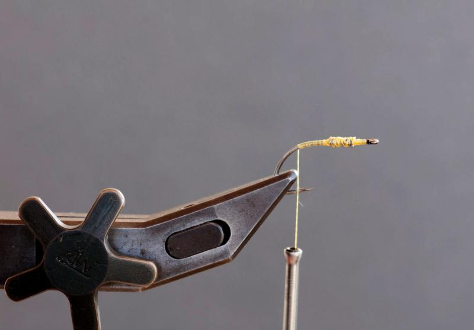

Secure the wire with some tight turns of thread, ending up at the hook bend.

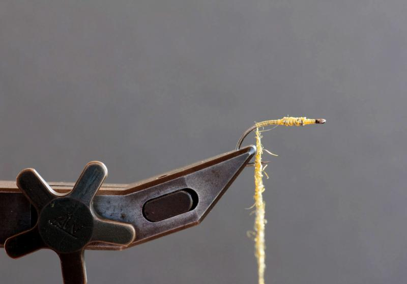

Dub the thread sparsely with some long fibered flash dubbing.

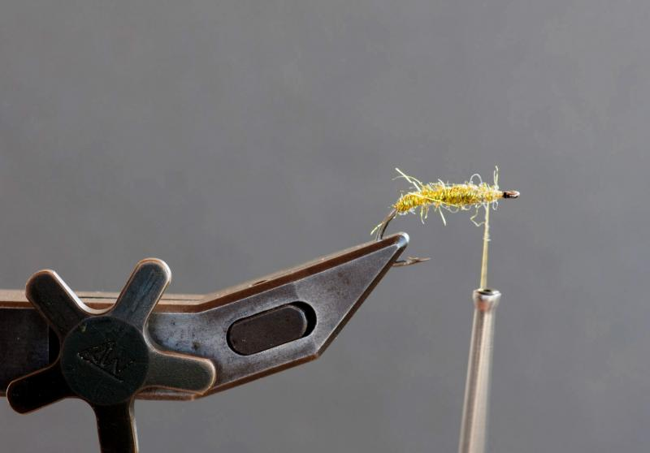

Form a slender, tapered body over the wire, leaving a bit of space in front for the hackle.

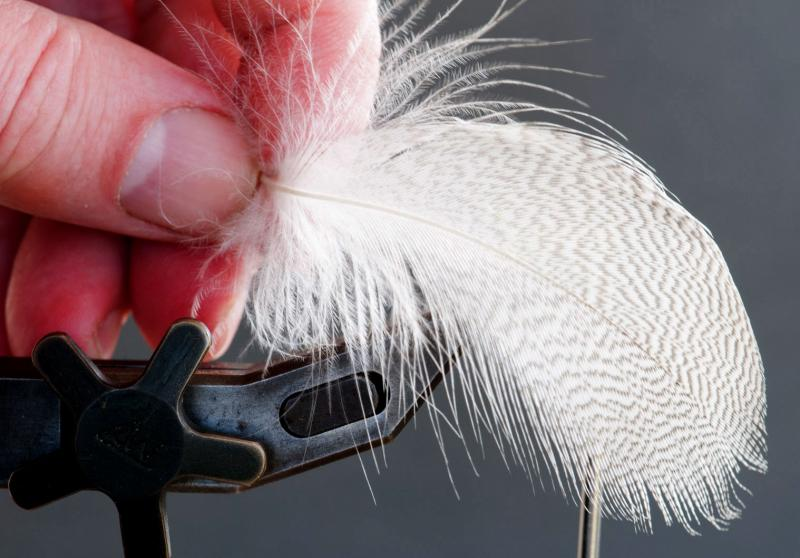

Select a fairly long barbed mallard feather.

The barbs can easily be twice the hook length.

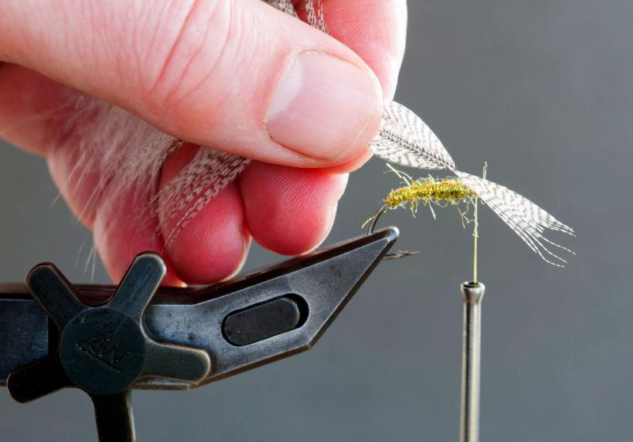

Grab the tip of the mallard feather and stroke back the barbs except for a few in the tip.

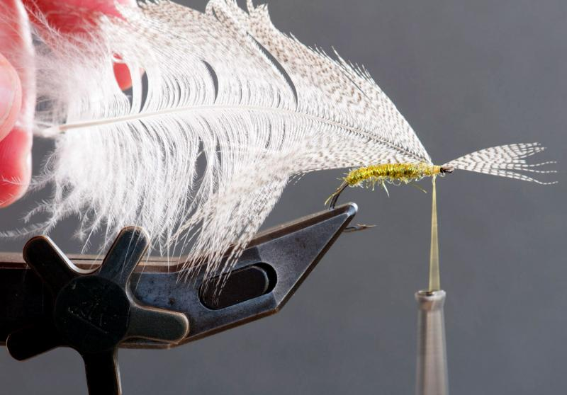

Tie in the feather at the tip, shiny and curved side out.

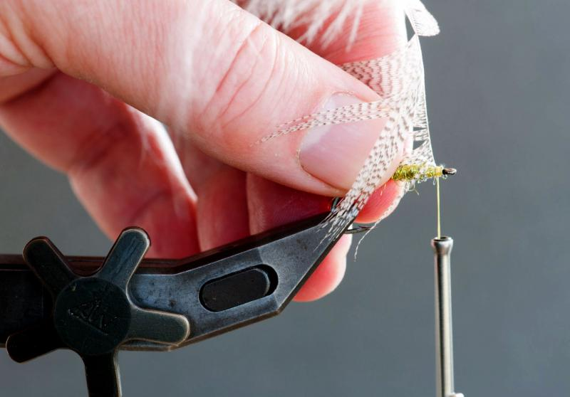

Bend back the tips, secure with a couple of thread wraps and cut off the tip.

The feather is ready to be wrapped.

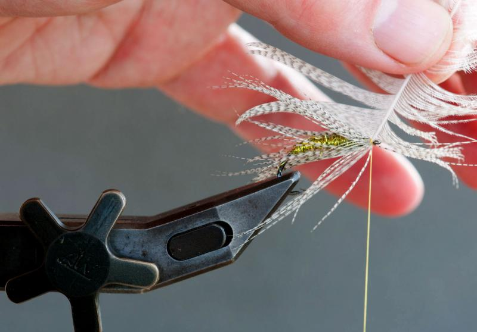

Pull the stem up, and stroke back the barbs with moist fingers to have them sweep back over the body once you start wrapping.

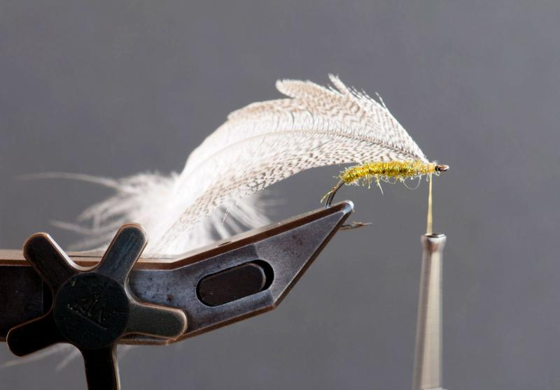

Once you have wrapped 3-4 turns of hackle, you can secure the stem with a single thread wrap or two and cut off the surplus feather.

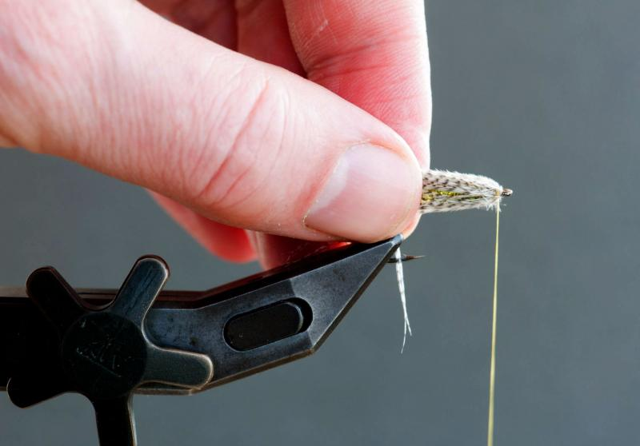

Pull the barbs back over the body to make room for tying the head.

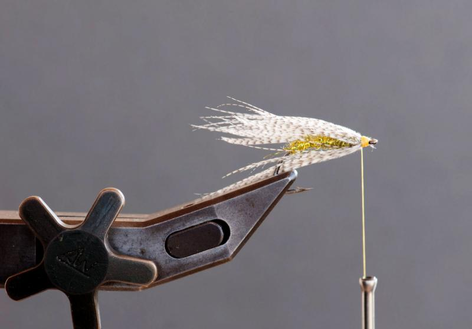

The head can be tied back over the barbs to press them down and give a slender shape to the fly.

Whip finish and cut the thread.

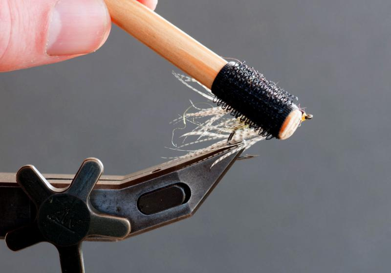

Use a small brush to comb through the hackle and the dubbed body to create a uniform cover over the hook shank.

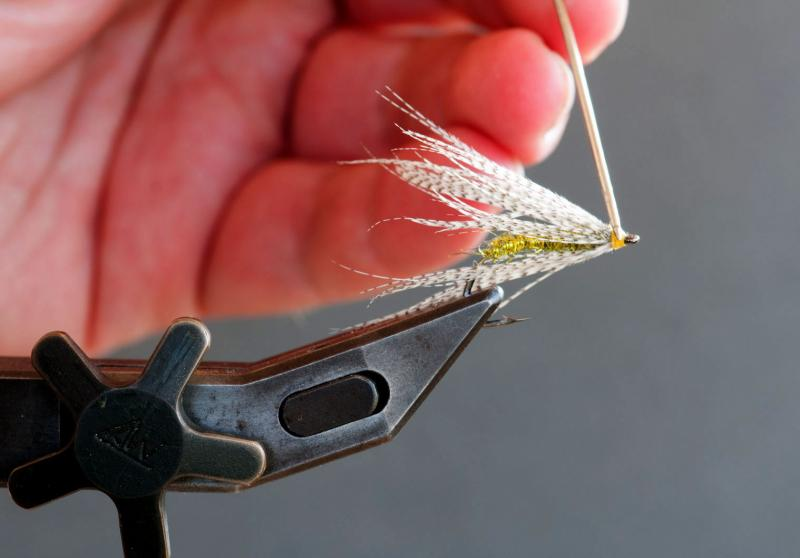

Varnish the head.

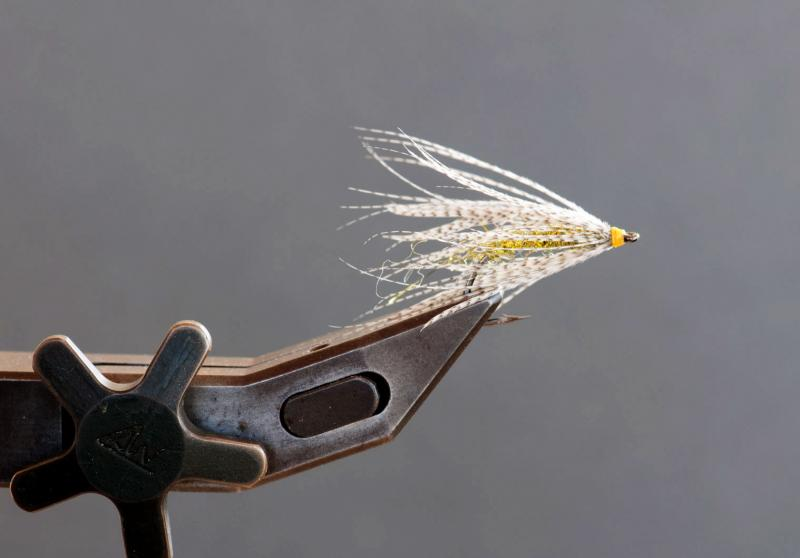

The fly is done and ready to fish.

### Varying the color.

It's not exactly rocket science, but here's an example of a copper/red variation.

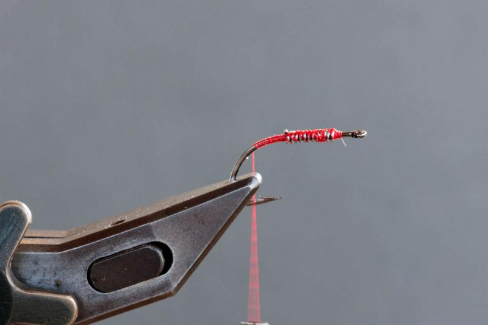

Using red thread as the base of a red Genner Bug variation.

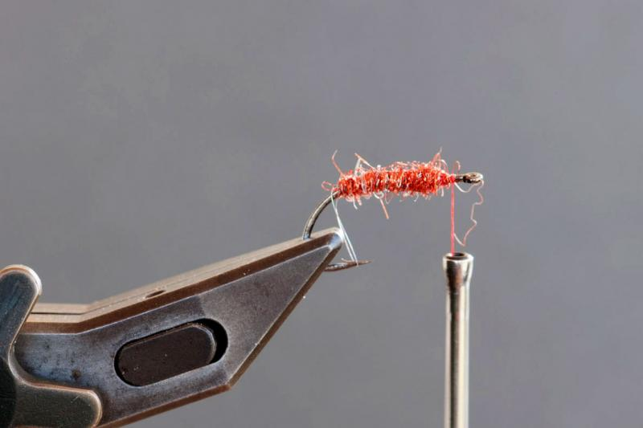

The dubbing can be red or copper, which are very effective and popular colors for sea trout flies.

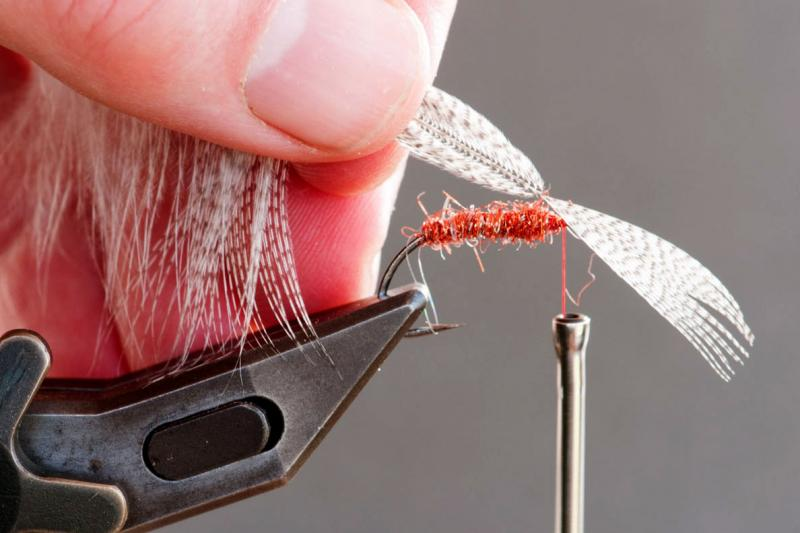

The mallard is the same subtle colors as mallard is: grey and dull tan.

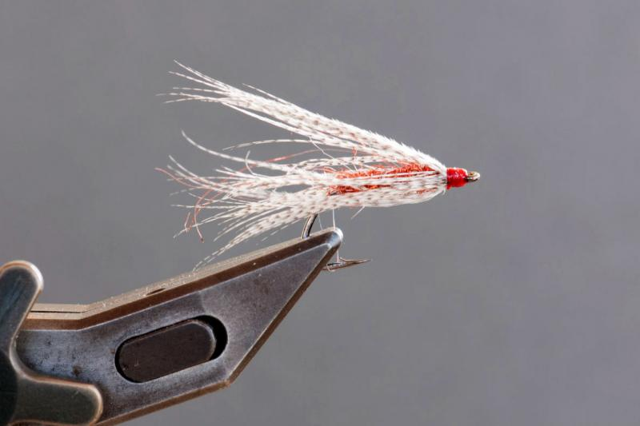

Another variation ready to leave the vice and try to lure a fish.
