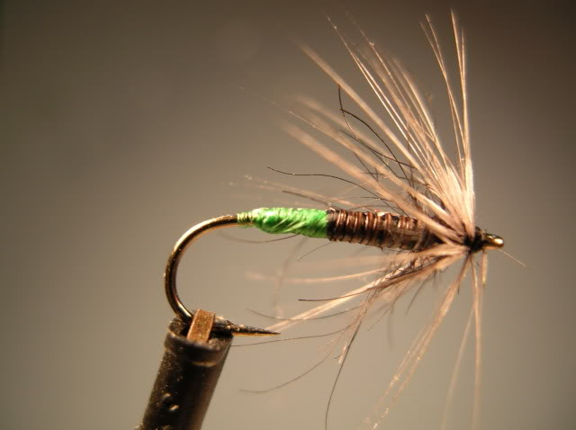
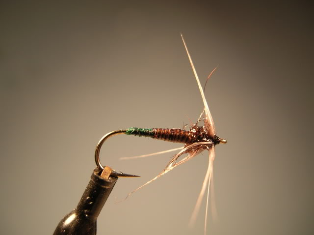

# The Grannom Soft Hackle Fly

Originator: Ron Eagle Elk.

Source: www.flytyingbug.com.

## Introduction

One of the key factors for me was getting the color of the egg sac correct.

After a bit of correspondence with Mike Conner, from the UK, he let me know that the key color is a dark emerald green.

Once I picked a silk that went to that color when wet, it made all the difference.

Funny what the fish will find as a key element in a fly.

## Where to fish

.

## When to fish

.

## How to fish

.

## How to tie

### What you will need

- Vice.

- Bobbin.

- Sharp scissors.

- Whip finish tool.

- Hook: Daiichi D1110 #12 and #14 or sized for your naturals.

- Thread: Black.

- Tag: Emerald colored silk floss.

- Body: Peacock Quill.

- Thorax: Brown squirrel and SLF blend.

- Hackle: Dun Hen.

- Head: tying thread.

- Cement: .

### Tying tip

.

### Tying the fly

Start with a hook.

...

Whip finish.
