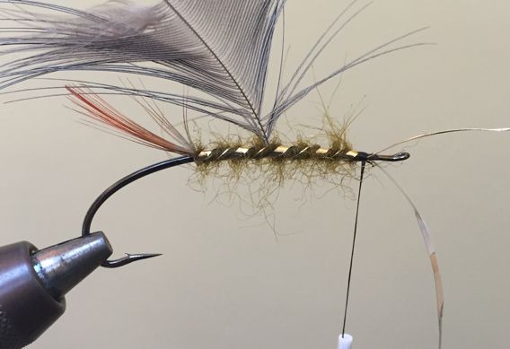

# The Lady Caroline Fly

Originator: .

Source: .

## Introduction

As the name implies, spey style fly patterns were originally used on the
River Spey, and are some of the oldest yet prettiest of all salmon fly
styles, probably dating back nearly 200 years.
There are a number of characteristics common in most spey style flies,
including the following materials:

- Longer shank hooks.
- Multi ribbings.
- Usually no tail.
- Bodies made from berlin wool, pigs wool, or seals fur dubbings.
- Long flowing coq or heron body hackles.
- Bronze mallard tented wings.

Some of these materials may sound exotic, but when they were first tied,
these were the materials available to game keepers on the Scottish
sporting estates during the Victorian age.
One of the most well known of the Spey flies is the “Lady Caroline”.
It is one of only two spey style flies that actually has a tail and has
been mentioned in numerous historic salmon fishing books over the years.
Roderick Haig-Brown used it extensively for steelhead in British
Columbia, and as such, it is still a firm favorite in many steelheaders
fly boxes as well.

It is very much worth while having a few of these flies in your fly box,
if only for a bit of nostalgia!.

## Where to fish
.

## When to fish
.

## How to fish
.

## How to tie

### What you will need

- Vice.

- Bobbin.

- Sharp scissors.

- Whip finish tool.

- Hook:

- Tail: Golden Pheasant red-breast, a few strands only.

- Body: Brown and olive-green Berlin wool mixed together in proportion of
  one part olive-green, two parts brown.

- Rib: From separate starting points, of gold tinsel (narrow), gold twist,
  and silver twist, wound the usual way, an equal distance apart.

- Hackle: Grey Heron, from tail (tied in at the point as usual) wound
  alongside gold tinsel.

- Throat: Golden Pheasant red-breast, two turns.

- Wings: Two strips of Mallard showing brown points and light roots.

- Head: tying thread.

- Cement: .

### Tying tip

1) The wing slips are more manageble if you leave attached to the stem.
   You can manipulate them any way you want without damage with a little
   care.

2) To make the fly a little more robust, counter-wind the hackle with
   gold wire.

### Tying the fly

On a nicely shaped Spey style hook, attach your thread and tie in some
oval gold tinsel on the back of the shank, followed by some gold flat
tinsel.

Tie in a small golden pheasant feather as a tail.

Spin some olive seals fur dub into a rope as a dubbing and wind up to
the rear third of the shank.

Tie in a blue eared pheasant feather by the tip.

Carry on winding the dubbing up to the head of the shank.

Wind the flat gold tinsel in up along the body.
You want to try and have 5 wraps in the traditional tie.

Interwind the oval gold tinsel in between the wraps of flat tinsel in even turns.

Give the dubbing a good scrub.

Wind the pheasant feather up to the head of the fly and pull the fibers
down to give yourself room for the wings.

Tie in a golden pheasant breast feather and wind as a hackle.
Pull the fibers downwards as well.

Prepare two slips of bronze mallard feather, from two matched feathers.

Wet the fibers of the mallard around the tying point with saliva.
This helps lubricate the thread and stops from pulling the fibers out of
place.

Tie in a second set of mallard slips.
This gives the wings more body that won’t dislodge when fished.

If your wing is sitting correctly they should look like the underside
keel of a boat.
This will help the fly swim well in the water.

Trim of the butts of mallard and whip finish a small head and varnish.
