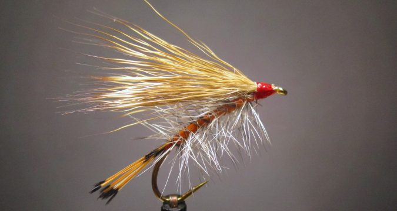

# The Montana Bucktail

Originator: unknown.

[Source](http://savageflies.com/fly-tying-a-montana-bucktail-classic-attractor-dry-fly-pattern/)

## Introduction

Of unknown origin, this attractor dry fly is similar to the various
stimulator fly patterns and likely imitates many of the same bugs.

## Where to fish

.

## When to fish

.

## How to fish

.

## How to tie

### What you will need

- Vice.

- Bobbin.

- Sharp scissors.

- Whip finish tool.

- Hook: #6 - 10 dry fly

- Thread: Uni 8/0 Red or Orange

- Tail: Golden Pheasant tippets

- Rib: Small wire 

- Body: Orange floss

- Hackle: Grizzly, palmered

- Wing: Deer hair

- Head: tying thread.

- Cement: .

### Tying tip

.

### Tying the fly

Start with a hook.

...

Whip finish.
