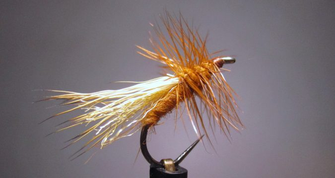

# The October Caddis Dry Fly

Originator: .

[Source](http://savageflies.com/october-caddis-fly-tying-appalachian-great-smoky-mountain-trout-patterns/)

## Introduction

While not a Great Smoky Mountain original, this version of a caddis dry
fly has been very popular in the park for decades.
These caddis hatch in a number of streams in the area, with perhaps the
most notable hatch in Abrams Creek.
An overall great fall pattern for many areas of the country.

## Where to fish

.

## When to fish

## How to fish

.

## How to tie

### What you will need

- Vice.

- Bobbin.

- Sharp scissors.

- Whip finish tool.

- Hook: #8 - 12 Dry Fly (straight or curved)

- Thread: Orange or Rusty brown

- Body: Rusty orange rabit

- Underwing: natural or Tan Z-lon

- Wing: Elk hair (or deer hair)

- Hackle: Brown dry fly

- Head: tying thread.

- Cement: .

### Tying tip

.

### Tying the fly

Start with a hook.

...

Whip finish.
