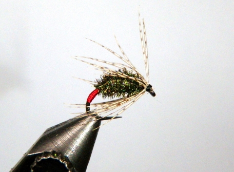

# The Peacock Red Tag Soft Hackle Fly

Originator: Jim Burchette.

Source: https://globalflyfisher.com/patterns/red-tag-revisited#node-68616.

## Introduction

A soft hackle take on the Red Tag.

## Where to fish
.

## When to fish
.

## How to fish
.

## How to tie

### What you will need

- Vice.

- Bobbin.

- Sharp scissors.

- Whip finish tool.

- Hook: Green Caddis Outfitters model 251B barbless, sizes 12-16.

- Tag: Red 70 denier for the red butt tag.

- Thread: Black 70 denier for the remainder of the fly.

- Weight: Small lead free wire.

- Rib: Fine silver wire.

- Body: Peacock herl.

- Hackle: Hungarian partridge.

- Head: tying thread.

- Cement: Flexament.

### Tying tips

Red thread can be used throughout the fly to keep from having to switch
colors.

UV cure resin can be applied to the red tag at the conclusion of step
number two.

This will create a more vivid red tag.

An ample coating of fly cement, such as Flexament, can be applied at the
conclusion of step six.

I feel this helps with adherence of the peacock body.

Moving the tying thread forward with the peacock wraps keeps the peacock
herl under control and prevents the herl from spreading on the hook
shank.

This technique was learned from viewing a video of master fly tier,
Tim Flagler.

Reverse wraps of fine silver wire reinforce the delicate peacock body
from unwrapping due to fish bites.

Subsequently, a length of thread or crystal flash can be used instead.

The red butt soft hackle fly can be tied without weight or minimal added
weight to fish in the surface film as an emerger.

A bead head version can be tied to get the fly deeper in the water
column.

This is one of my confidence flies that is a proven producer.

I believe you will like fishing this pattern.

### Tying the fly

Secure the hook firmly in the tying vise jaws.

Start the red thread rearward of the hook eye and wrap down the hook
shank as a base for the lead free wire and on down the bend of the hook
to create a red butt tag. Several layers of thread should be made for
the tag.

Wrap the midsection of the hook shank with 6 turns of lead free wire and
cover with thread.

Make a half hitch or a 3 turn whip finish around the hook shank with the
red thread and snip off.
Start the 70D black thread on the hook shank and make wraps rearward,
stopping at the beginning of the red tag.

Tie in a three inch length of fine silver wire with 2 turns of thread.

Select 2-3 pieces of peacock herl.
Cut the fine tips of the peacock herl back an inch or so and tie in the
bundled pieces of peacock.
Secure the wire and peacock herl with additional thread wraps as needed.
Return the thread to the start of the red tag at the hook bend.

Grasp the peacock herl butts and make a wrap around the hook behind the
hanging thread.
Continue wrapping the peacock herl, moving the thread forward as you
wrap up the hook shank.
Stop about a hook eye distance from the hook eye.
Secure the wraps of peacock with 2-3 turns of thread.

Grasp the silver wire and make 5-6 counter-clockwise wraps over the
peacock.
Tie off the wire with 2-3 turns of thread where the peacock body stopped.

Select a single Hungarian partridge feather and strip the fuzzy fibers
from the feather.
Holding the feather by the tip, gently preen the fibers outward from the
stem.
Keep a cluster of tip fibers to use for attaching the feather to the
hook.
With the underside of the feather facing away, secure the tip of the
feather with 2-3 wraps of thread and trim the excess feather tip.
At this point, I like to apply a small drop of head cement and give it a
moment to dry to prevent the feather from pulling out during the next
step.

Attach your hackle pliers to the partridge feather stem and make two
turns around the hook shank.
Secure the feather with 2-3 wraps of thread.

Snip the feather stem and any errant feather fibers.

Make additional wraps of thread as needed to build a small head and
finish the fly with a 3-4 turn whip finish and apply head cement.
