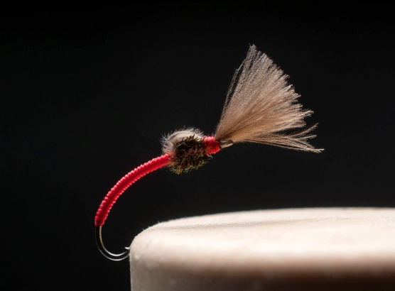

# The Red Tage Once and Away Fly

Originator: Hans van Klinken.

Source: https://globalflyfisher.com/patterns/red-tag-odyssey#node-68443.

## Introduction

.

## Where to fish
.

## When to fish
.

## How to fish
.

## How to tie

### What you will need

- Vice.

- Bobbin.

- Sharp scissors.

- Whip finish tool.

- Hook: Partridge Klinkhamer GRS 15ST #18.

- Thread: Semplerfli Nanosilk, black.

- Body: UNI 8/0 tying thread, red.

- Thorax: A couple of peacock herl.

- Wing: 3-4 small, natural or brown CDC feathers.

- Head: tying thread.

- Cement: .

### Tying tip

.

### Tying the fly

Start with a hook in the vice.

Start the red thread a couple of eye widths behind the hook eye.

Wrap the thread in touching turns well into the bend of the hook and back. Repeat.

Whip finish and cut the red thread.

Start the black thread right in front of the red.

Bundle up the CDC feathers to form a small tuft with aligned tips.

Tie in the CDC bunch pointing to the rear of the fly. Make it long enough. The length isn’t critical since the wing is trimmed when done.

Tie in the herl in front of the CDC and wrap to form a small thorax.

Tie down and trim herl.

Bend the CDC forwards over the thorax and tie down right behind the hook eye.

Lift up the wing and form a small “thread dam” to force it upright.

Whip finish and cut thread.

Varnish gently on the final wraps.

Trim the wing to the desired length, typically 2/3 of the shank length.
