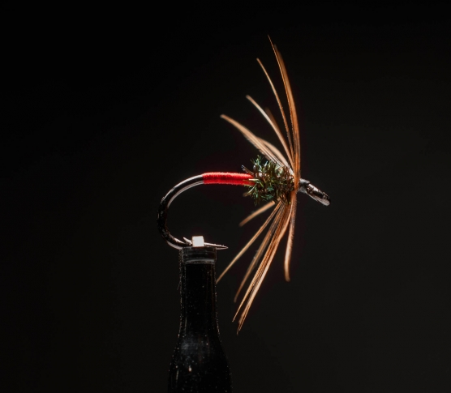

# The Red Tag Spider Fly

Originator: Martin Joergensen (sort of).

Source: https://globalflyfisher.com/patterns/red-tag-odyssey#node-68445.

## Introduction

.

## Where to fish
.

## When to fish
.

## How to fish
.

## How to tie

### What you will need

- Vice.

- Bobbin.

- Sharp scissors.

- Whip finish tool.

- Hook: Wet fly down eye size 10-14.

- Body: UNI 8/0 tying thread, red.

- Thread: Semplerfli Nanosilk, black.

- Thorax: A couple of peacock herl.

- Hackle: Light brown hen hackle.

- Head: tying thread.

- Cement: .

### Tying tip

.

### Tying the fly

Start with a hook.

Start the red thread a couple of eye widths behind the hook eye.

Wrap the thread in touching turns to just in front of the bend of the
hook and back. Repeat.

Whip finish and cut the red thread.

Start the black thread right in front of the red.

Tie in the herl and wrap to form a small thorax, just leaving space for
the hackle.

Pick a hackle with barbs about 1.5 times the shank length.

Remove the fluffy barbs.

Hold the hackle by the stem curved side up, tip pointing away from you.

Remove all barbs on the right side of the hackle.

Tie it in by the stem right in front of the thorax pointing away from
you, the remaining barbs pointing to the rear of the fly.

Wrap it a couple of times to form a very delicate and sparse
“umbrella-like” hackle. Less is more.

Tie down and trim the tip off.

Whip finish and cut thread.

Varnish very sparsely on the final wraps.
