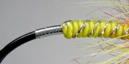

# The Twist of Lemon Fly

Originator: .

[Source](https://globalflyfisher.com/patterns/twist-of-lemon)

## Introduction

This fly uses a special technique where a strand of floss and a strand
of tinsel is twisted together before the combo is wound on the hook
shank.
The rope - if twisted regularly enough - will form a nice segmented body
with built in ribbing.
The name of the fly is divised from this technique and the fact that
it's made mainly from yellow materials.
A similar fly without the twisted body is Orange Twist.

## Where to fish

.

## When to fish

## How to fish

.

## How to tie

### What you will need

- Vice.

- Bobbin.

- Sharp scissors.

- Whip finish tool.

- Hook: 6-2 Bartleet salmon fly hook

- Thread: Yellow/white and Black

- Tag: Narrow flat silver tinsel

- Body: Oval silver tinsel and yellow floss twisted

- Thorax: Red flash dubbing

- Hackle: Yellow hen hackle

- Head: Black

- Cement: .

### Tying tip

.

### Tying the fly

Start with a hook.

Cover the hook shank with a smooth layer of light thread.
Let the thread hang down to reach the hook point

Tie in a strip of narrow silver tinsel and wind it to reach a point
above the point of the barb and back

Tie down and cut surplus

Take a strand of yellow floss and a similar strand of oval silver tinsel

Tie in both at the tag

Wind the thread forwards, form a smooth foundation of thread for the
body

Twist the floss and tinsel counterclockwise using hackle pliers.

The twist should form a tight and even rope

Wind the rope forwards in close and even turns to a point 1/4 shank
length behind the hook eye

Tie down and cut surplus

Dub some red flash dubbing on the thread and form a short, dense thorax

Tie in a yellow hackle, tip first and hackle stem upwards

Wind the hackle clockwise in wet fly style, folding it over and stroking
barbs to the rear of the hook

2-3 turns will suffice depending on the hackle

Tie down and cut surplus

Whip finish the light thread and tie in the black

Form a nice, small head from black tying thread

Whip finish and varnish ...
