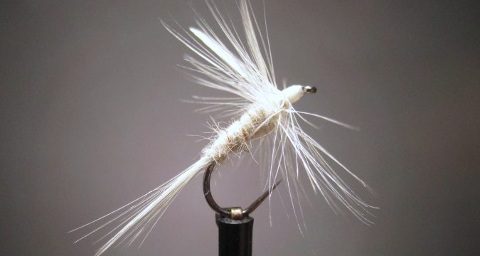

# The White Moth Dry Fly

Originator: .

[Source](http://savageflies.com/white-moth-dry-fly-fly-tying-appalachian-great-smoky-mountain-trout-patterns/)

## Introduction

This 75 year old pattern from western North Carolina is an easy-to-tie
fly that is a great option for those late evenings when the sun is
starting to set.
This high-floater, highly visible fly is perfect for those of us who may
have trouble seeing the tiny darker colored flies!

## Where to fish

.

## When to fish

## How to fish

.

## How to tie

### What you will need

- Vice.

- Bobbin.

- Sharp scissors.

- Whip finish tool.

- Hook: #12 - 18 dry fly

- Thread: White

- Tail: White hackle fibres

- Rib: Copper wire, small

- Body: Mink underfur (substitue rabit or synthetic)

- Wing: White hackle tips

- Hackle: White dry fly

- Head: tying thread.

- Cement: .

### Tying tip

.

### Tying the fly

Start with a hook.

...

Whip finish.
