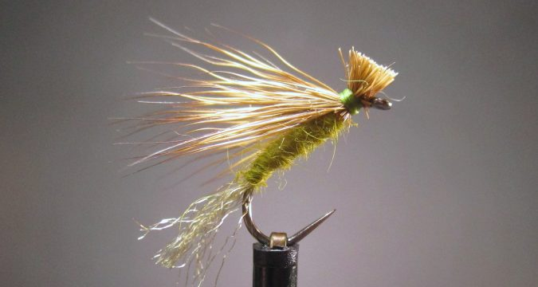

# The X-Caddis

Originator: Craig Matthew and John Juracek of West Yellowstone, Montana.

[Source](http://savageflies.com/fly-tying-the-x-caddis-classic-american-trout-pattern/)

## Introduction

Created by Craig Matthew and John Juracek of West Yellowstone, Montana
in 1980, the X-Caddis is a great imitation when the fish are keying on
emerging caddis flies that are getting stuck in the surface film trying
to shed their shuck.

## Where to fish

.

## When to fish

Try this pattern when you find yourself getting refusals to a standard
Elk Hair Caddis.

## How to fish

.

## How to tie

### What you will need

- Vice.

- Bobbin.

- Sharp scissors.

- Whip finish tool.

- Hook: #12 - 18 dry fly

- Thread: Olive, or to match body

- Shuck: Z-lon or Antron synthetic fibres

- Body: fur or synthetic dubbing (olive, tan or dun)

- Wing: Yearling elk or deer hair

- Head: tying thread.

- Cement: .

### Tying tip

.

### Tying the fly

Start with a hook.

...

Whip finish.
