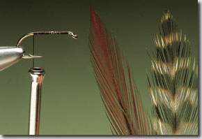
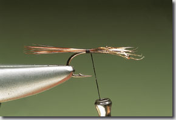
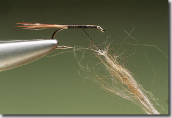
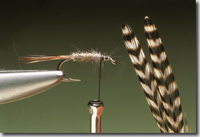
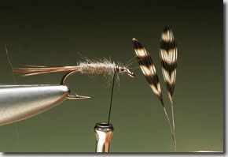
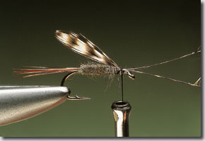
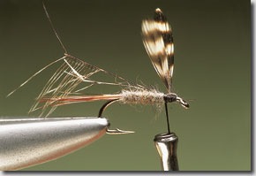
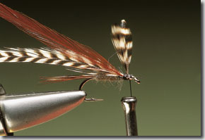
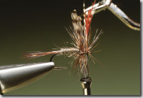
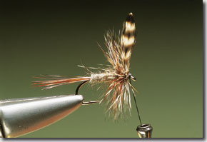

# The Adams River Fly

## Introduction

This American import is now, quite probably, the most popular and widely used dry-fly in the UK.

Its success lies in the fact that it is a superb general representation of a whole range of upwinged flies and so can be used with confidence on an almost limitless number of waters.

While the combination of grey and brown might not seem ideal for imitating flies that are mostly various shades of olive, the Adams still manages to tempt fish whether they are feeding on a variety of food forms or whether they are targeting a specific hatch.

The blend of grizzle and brown cock hackle fibres seems particularly effective and with the addition of grizzle hackle tips for the wings the Adams is a very lively looking fly.

The Adams is tied in a range of forms, from the standard one with hackle-point wings and a collar hackle to parachute and thorax-tied versions.

In the latter the hackle is tied in open turns rather than as a dense ruff.

The technique produces a sparser more natural looking fly that is well suited for fishing smooth glides.

Given that the pattern can be used to suggest any number of upwinged species, it is tied in a very large range of sizes.

A size 8 makes a reasonable representation of a Mayfly while, tied right through to a size 22, it can cover even the smallest Caenis or iron blue.

## Where to fish

As it is such a general fly pattern, it will catch fish on any river or stream.

It is invariably fished on or in the surface as a dry-fly or emerger pattern.

## When to fish

It will work right throughout the season whenever either trout or grayling are prepared to feed on the surface.

## How to fish

Fished singly on a floating line and a tapered leader, it is either dead-drifted upstream or, where permissible, fly-first downstream.

It can be used to target individual rising fish or used as a search pattern when drifted over a likely looking spot.

## How to tie

What you will need:

- Vice.

- Bobbin.

- Sharp scissors.

- Whip finish tool.

- Hook: Size 8–22 medium to lightweight dry-fly.

- Thread: Black or brown.

- Tail: Grizzle and brown cock hackle fibres.

- Body: Grey rabbit or muskrat underfur.

- Wing: Grizzle hackle points.

- Hackle: Grizzle and brown cock hackles.

### Tying tip

When tying in hackle-point wings, always fold the bare stems and bind them down before removing the excess.

This stops the wings slipping out.

### Tying the fly

Run the tying thread down the shank to the bend.

Select two large cock hackles — one brown, the other grizzle.

Tear a few fibres from each feather and place them all together so that the tips are level.

Catch them in at the bend to form the tail.

Take a pinch of grey fur — rabbit or muskrat underfur is ideal.

Dub it on to the tying thread to form a thin, slightly tapered rope.

Starting right at the base of the tail wind the dubbed fur over the shank in close turns.

Ensure that no gaps are formed.

Carry the body along the shank until three-quarters of its length has been covered.

Select two small, wellmarked grizzle hackles of equal size.

Strip the fibres from the stems of both hackles to leave two short points.

Both should be slightly longer than the hook shank.

Place the tips together, shiny sides in.

This procedure means that the tips curve away from one another.

Catch them in at the front of the body.

Secure the tips with tight thread turns.

Pull them upright then draw the bare stems between the tips.

This helps divide them and fixes them securely in place.

Remove the waste ends of the hackle stems then select a brown and a grizzle cock hackle.

These should have exactly the same fibre length.

Remove the soft, waste fibres from the base of both hackles before catching them in together behind the wing.

Take hold of both hackles with hackle pliers and wind on three turns behind the wing then two or three in front.

Secure the hackle tips at the eye with tying thread then remove the excess.

Build a small, neat head and cast off the thread with a whip finish.

