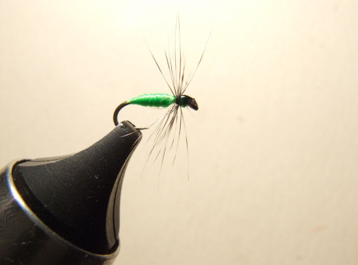
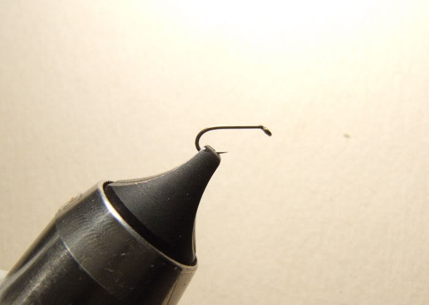
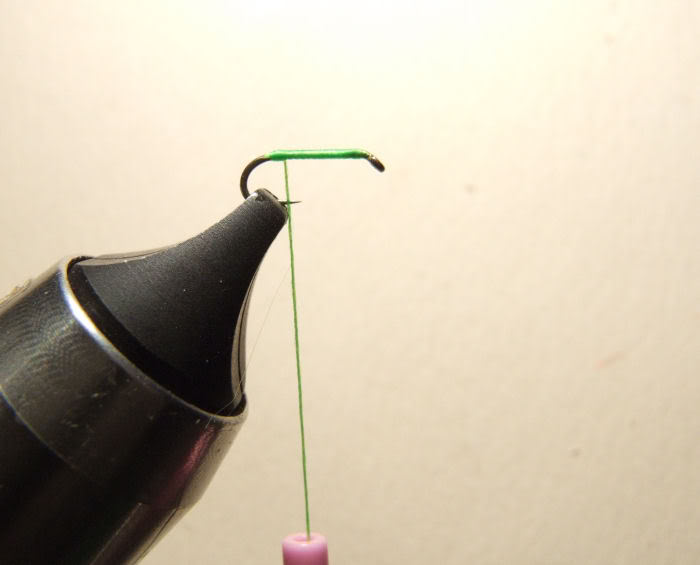
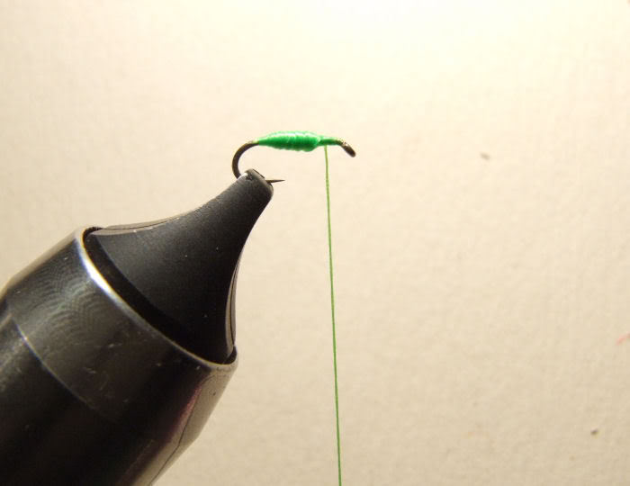
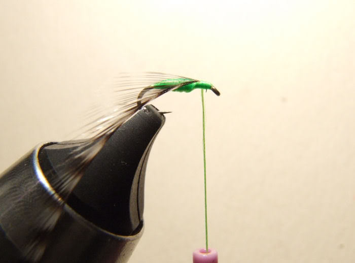
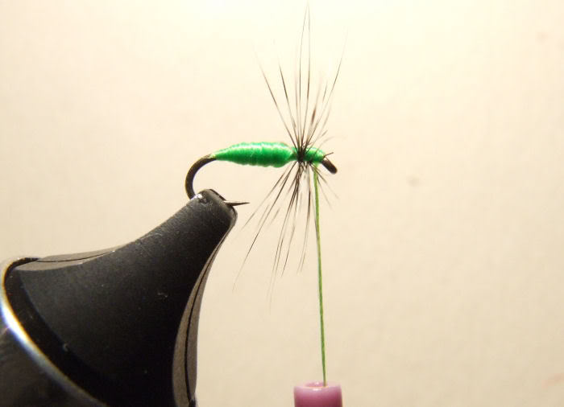
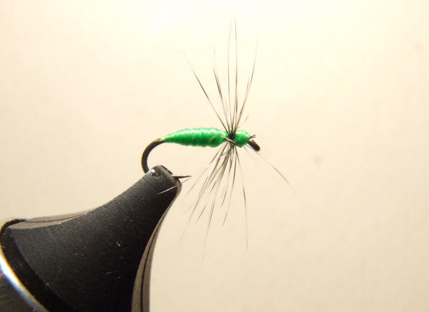

# The Aphid/Green Midge Fly

Originator: albannach cuileag.

Source: www.ukflydressing.proboards.com.

## Introduction

.

## Where to fish

.

## When to fish

.

## How to fish

Cast it so that it drops off a leaf onto the water !

## How to tie.

What you will need:

- Vice.

- Bobbin.

- Sharp scissors.

- Whip finish tool.

- Hook: Kamasan B405 size 18.

- Thread: UTC Fluo. Chartreuse 140 Denier.

- Body: thread.

- Hackle: fine Grizzle cock.

- Head: tying thread.

- Cement: .

### Tying tip

.

### Tying the fly

Mount your hook - if you can see it !

Take your thread to the start of the bend and return ...

... almost to the eye and build a carrot shaped abdomen.

Tie in your hackle.

2 or 3 turns is enough to give the indication of wings and legs.

Whip finish with only 3 turns of thread to keep the head small.

Dab the head with a permanent black marker and varnish carefully to complete the Aphid / Green Midge.
