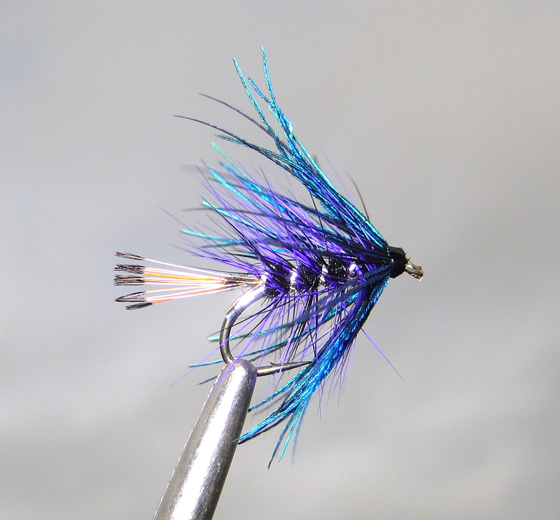

# The Bruiser of Sorts Fly

Originator: .

Source: .

## Introduction

.

## Where to fish
.

## When to fish
.

## How to fish
.

## How to tie

### What you will need

- Vice.

- Bobbin.

- Sharp scissors.

- Whip finish tool.

- Hook: .

- Thread: .

- Tag: Silver tinsel.

- Tail: Golden Pheasant tail.

- Rib: Silver oval tinsel.

- Body: Black Seal fur.

- Body hackle: Black and violet/blue cock.

- Front hackle: Blue peacock.

- Head: tying thread.

- Cement: .

### Tying tip

.

### Tying the fly

Start with a hook.

...

Whip finish.
