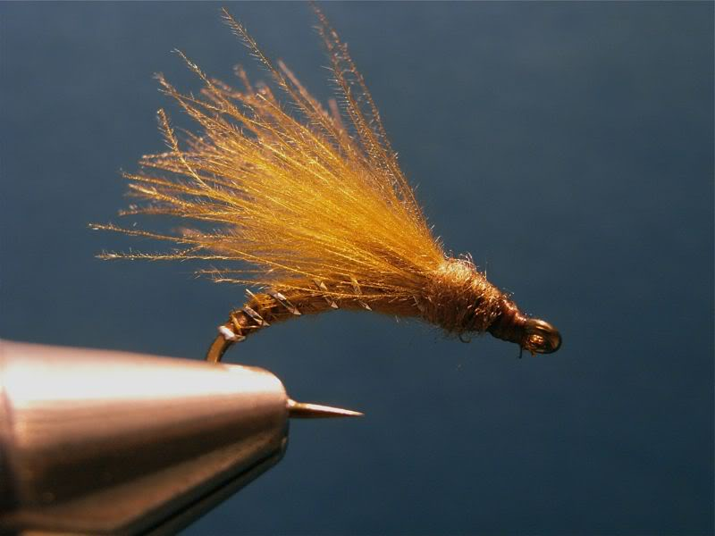
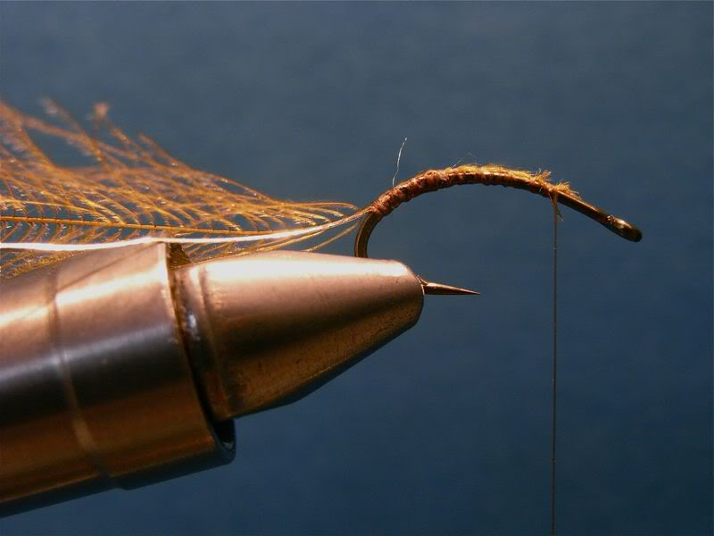
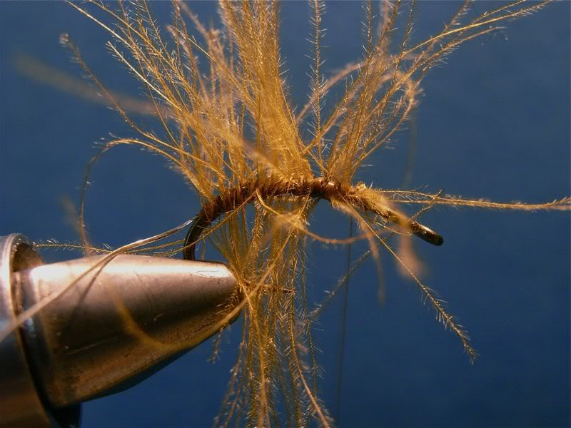
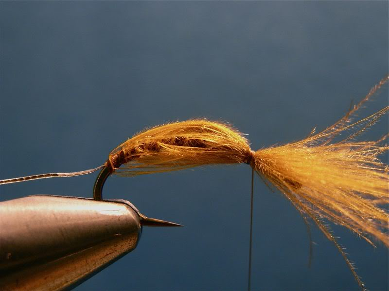
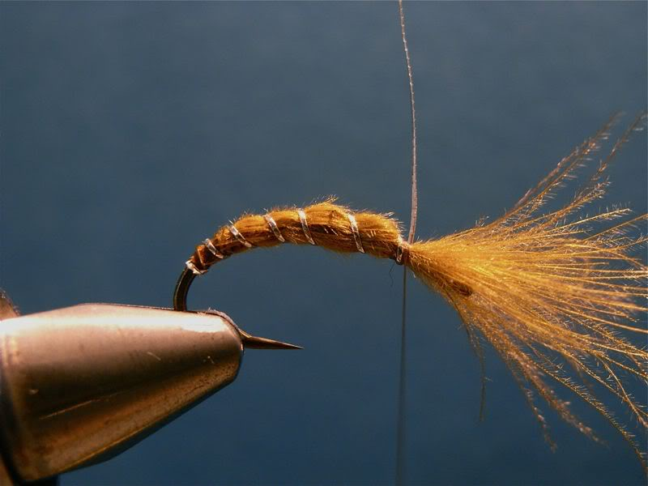
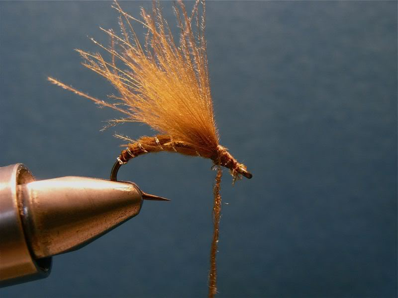
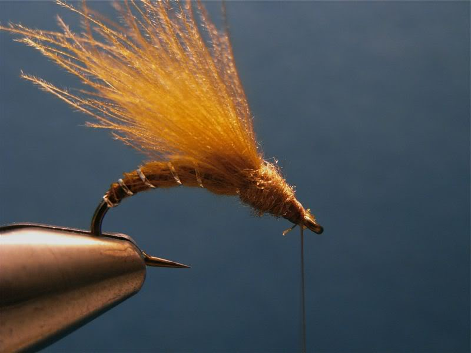

# The CDC Sedge Hatcher Fly

Originator: Sigve Monsen.

Source: www.ukflydressing.proboards.com.

## Introduction

.

## Where to fish
.

## When to fish
.

## How to fish
.

## How to tie

What you will need:

- Vice.

- Bobbin.

- Sharp scissors.

- Whip finish tool.

- Hook: .

- Thread: .

- Rib: Silver tinsel.

- Body: .

- Dubbing: .

- Head: tying thread.

- Cement: .

### Tying tip

.

### Tying the fly

![1}(1.jpg)

Start with a hook.

Tie in the end of e CDC feather and some rib tread (I've used silver tinsel).

Hackle the CDC as shown one the picture.

Pull all the fibers towards the head of the fly and tie them down.

Rib it as shown.

Now you'll gather the CDC fibers and make a wing as shown in picture.

You may all so need to add some more depending on the quality of your CDC.

Dubb thorax.

Whip finish.
