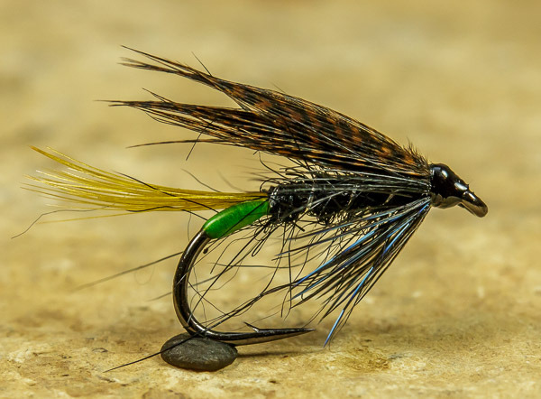

# The Connemara Black (Variant) Fly

Originator: .

Source: Phil (http://www.riverdaleflyfishing.co.uk).

## Introduction

.

## Where to fish
.

## When to fish
.

## How to fish
.

## How to tie

### What you will need

- Vice.

- Bobbin.

- Sharp scissors.

- Whip finish tool.

- Hook: FM competition black nickel size 12.

- Thread: Black.

- Tag: Chartreuse floss.

- Tail: GP crest.

- Rib: Silver oval tinsel.

- Body: Black seal.

- Hackle: Black Hen and Blue Jay.

- Wing: Bronze Mallard..

- Head: tying thread.

- Cement: .

### Tying tip

.

### Tying the fly

Start with a hook.

...

Whip finish.
