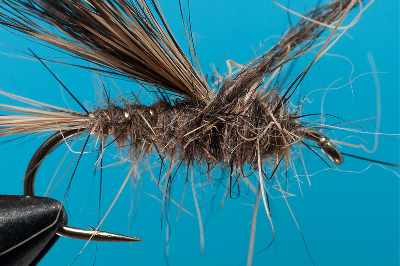

# The Gold Ribbed Hare Nymph Fly

Originator: Lucian Vasies.

Source: www.flytying.ro.

## Introduction

The Gold Ribbed Hare Nymph is probably one of the oldest nymph used by fishermen.

Back in the past this nymph was tied differently and was upgraded in time.

First was an ugly fly with dubbing all over the hook shank and a few turns of gold tinsel.

Now, with the same material for making body: hare dubbing known also as wild rabbit dubbing the fly have a thorax part area very distinctive and a more clear silhouette.

The fly is a classic and catch a lot of fish all the time.

Tied in different variants to match the local preferences of the fish the Gold Ribbed Hare Nymph is a must have fly in all boxes because is simple, sexy and catch fish !

## Where to fish

.

## When to fish

.

## How to fish

.

## How to tie

### What you will need

- Vice.

- Bobbin.

- Sharp scissors.

- Whip finish tool.

- Hook: Daiichi D1180 #12.

- Weight: lead foil or lead wire.

- Thread: Uni 8/0 Black.

- Tail: Hair fibers from wild rabbit.

- Rib: Oval Tinsel in gold color.

- Body: Troutline Super Spike Dubbing or Troutline Buggy Dubbing.

- Thorax case: Guard hair fibers from wild rabbit.

- Head: tying thread.

- Cement: .

### Tying tip

.

### Tying the fly

Start the thread.

Whip finish.
