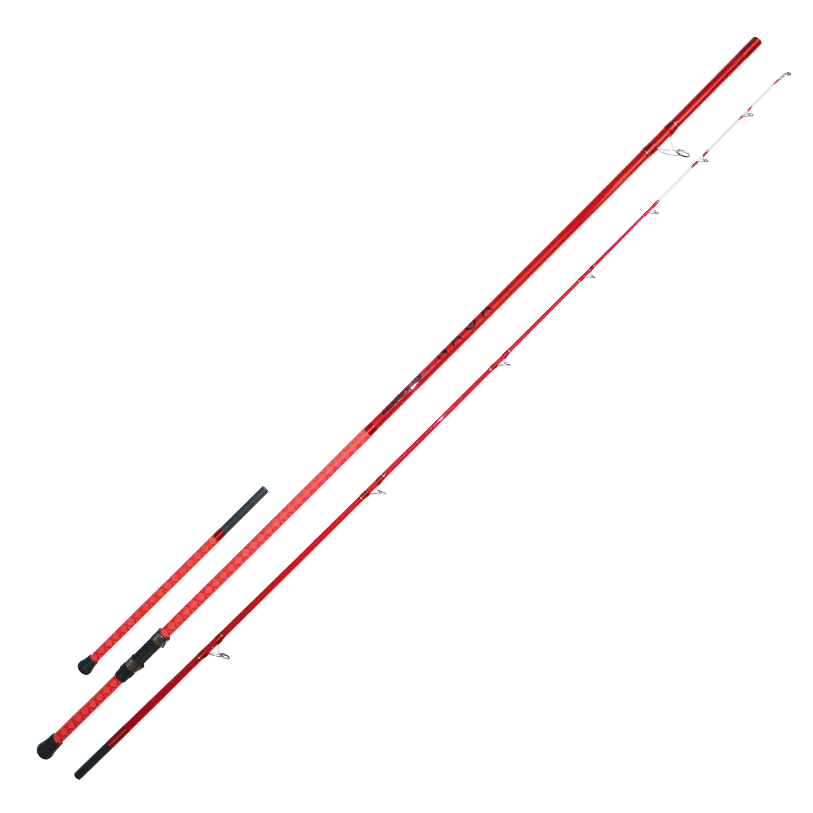
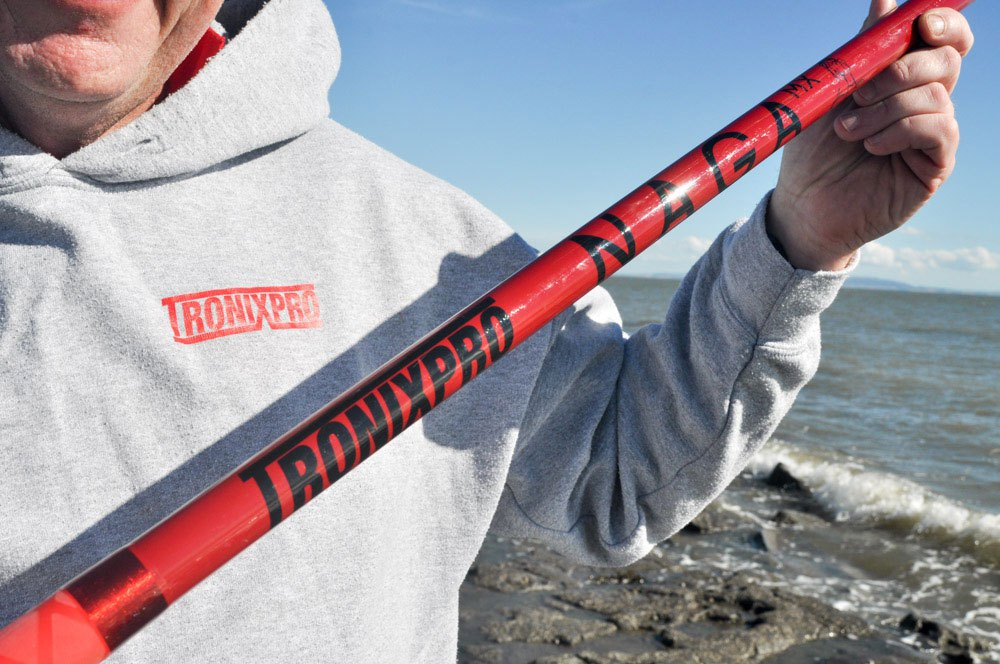
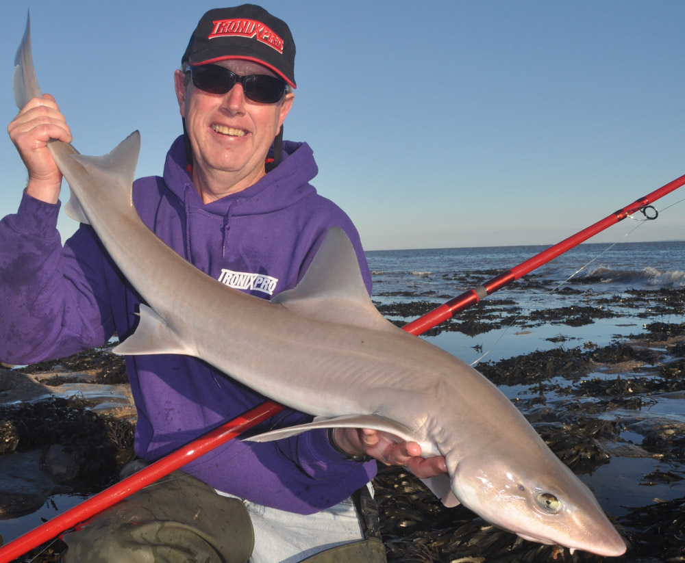
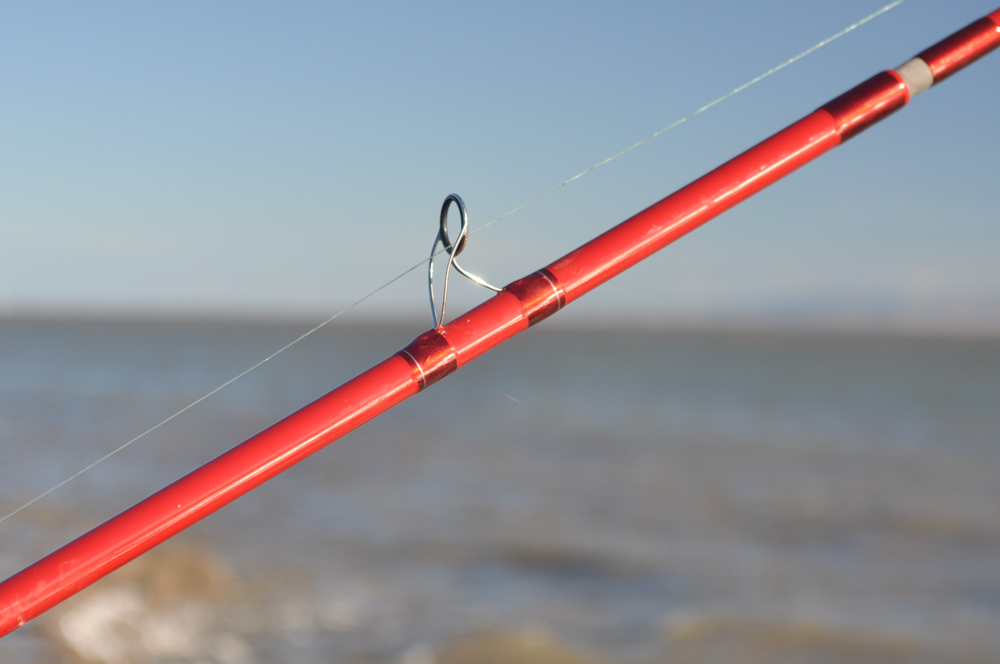
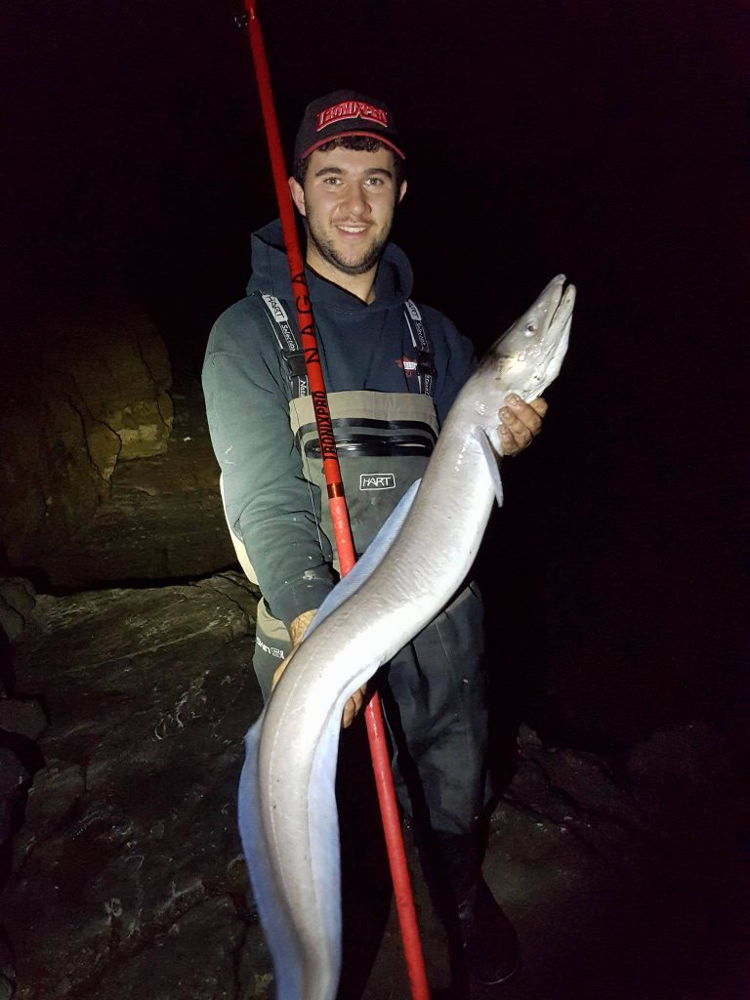
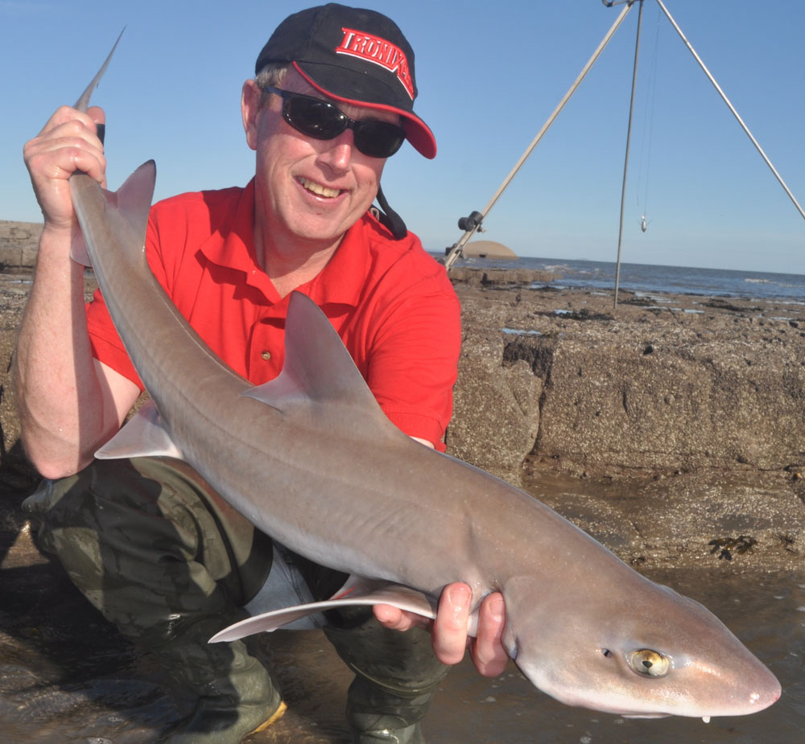

# TRONIXPRO NAGA MX BEACHCASTER

## Tronix Naga MX 14ft 4-8oz

Retrieved from: https://www.gerrysfishing.com/tronix-naga-mx-14ft-48oz.ir

After Tronix's success with with their first 4 surf rods they have moved into the
2 piece general purpose beach rod and what a belter it is.

This rod oozes quality and has been designed by Joe Arch as an 'all rounder'
suitable to use across the country over clean to mixed ground.

It has a particularly fast recovery and produces impressive lead speed especially
when power casting techniques are used resulting in extreme distances.
It's optimum casting weight is 5oz.

It is finished in Fuji K guides, x wrap shrink tube and a moveable reel seat.

Features:

* Length 14ft
* Casts 4-8oz
* 2 Piece
* Coasters
* Fuji K guides
* Reducer
* X wrap shrink tube

## Introducing the Tronixpro Naga MX

November 24, 2016  by Mike Thrussell Jnr

Whilst we'e well known for our high end continental style rods such as the Medusa
and the Cobra, an out and out, traditional style beachcaster is not something we've
done until now!

The Tronixpro Naga MX is the brain child of Welsh International, Joe Arch.
Joe is one of the best all round competitive anglers there is, having represented
Wales no less than thirteen times at World Championships, helping them win team
bronze once and team silver and gold twice.
Joe has also won individual gold and silver as well as winning the Penn Sea League
Final twice in addition to successes in numerous other tournaments around the world.
In short, Joe knows a thing or two about catching fish from the shore.

When we approached Joe with the idea of creating a Signature Series rod for
Tronixpro, we automatically and wrongly assumed he would look to introduce
another continental style rod into the Tronixpro mix, a type of rod Joe has
used to much success over a long and successful career.
However, he didn't, he took a totally different tack, he wanted to build a rod
that the majority of anglers would use a traditional, two piece 14 ft beachcaster
complete with reducer and capable of launching leads between 5 and 8 ounces.

Finished in a fetching shade of deep red, complimented by red and silver whippings
and a lighter red shrink wrap which covers the lower third of the butt section,
this rod stands out from the crowd.
Fuji K Alconite guides in silver match perfectly with the whippings, their lean
forward frame reducing friction to aid casting distance and reducing tangles.
The tip section comes with a phosphorescent paint finish between the tip and third
intermediate ring.
To complete the rod, two Tronixpro Coasters are included to allow you to attach
your reel to the rod.

Over the extensive period I've been field testing the rod, I love the fact I can
see it at night without having to switch the headlight on.
I've fished with it over rough ground across the Bristol Channel and other
South Wales marks and it has been more than capable.
I've won a recent match with the rod catching smoothhounds and conger.
A powerful rod that retains loads of power, has a lovely supple tip and will give
any top end beachcaster a run for its money and it costs a lot less too !

Joe Arch

Purposefully, the colour scheme of the Naga MX has been designed with night fishing
in mind.
The phosphorescent tip section with a charge from a UV light or headlight give you
ample bite detection without having to constantly switch your light on to see your
rod tips.
The silver stainless Fuji K Alconite guides, red with silver detail whipping and
almost metallic red blank colour allow you to see the rod in low light levels.
Whether that be moonlight, street lighting or any other far off, surrounding light.

Constructed of lightweight 40 ton carbon the Naga MX features a slim diameter blank
with maximum strength and minimal weight.
It's built in a two equal section configuration, each section is 7 ft with a separate
reducer included.
At 7 ft broke down the rod is easily transportable in most vehicles, the added
reducer allows you to fish your reels down, alternatively for the angler who likes
to fish with their reels up, a Fuji butt cap is included so you can do away with
the reducer.
A robust rod bag with extra pockets for the reducer and the coasters is included.

I've been fishing with the Naga extensively both at home in Wales and also on my
Norway trips.
Norway accounted for several good sized plaice which the rod handled like a dream.
At home, I've been targeting smoothhound and conger.
Teamed up with a Daiwa Saltiga filled with heavy braid I went in search of my
target 20lb conger from the shore.
I was fishing over slack water with a big cuttlefish bait when on dead slack
water I noticed my line had gone slack.
Hitting into the fish I knew it was a good eel and the Naga MX sprang into life.
Absorbing the heavy lunges, head shakes and giving me the power to steer the eel
around snags and through thick kelp.
There was a big sea running that night, with a big swell and I was thankful I had
the Naga MX with me to give me that extra confidence.
Once it was landed, it wasn't quite the 20 lber I was hoping for but a cracking
fish all the same of just shy of 16 lbs.

Mario Asprou

The highly tuned blank has been designed to get you casting to maximum fishing
distances with ease.
It has bags of power for the big chuckers out there and is forgiving enough that
even novice casters can pick this up and start casting to good distances.
A versatile rod, its supple tip is ideal for fishing at closer range or in
gentle, rolling surf for whiting, flatfish and smaller species.
When you want to go after the bigger fish, the strong, powerful butt gives you
the lift to drag smoothhound, conger, huss and even tope away from snaggy,
kelpie ground on the roughest rock marks.
It's an ideal rod for the angler who fishes serious tides or rough ground marks.
It can handle pretty much anything you can throw at it with ease.
In the right hands, the rod is an exceptional casting tool that has the capability
to reach extreme distances.

Over 18 months of field testing has proven the rod in as many situations as possible.
From standard, British style beach fishing to snaggy rock marks across Britain,
Ireland and Norway.
We've tried to throw as much at it as we can in order to produce an exceptional rod,
that has soul and real fishing pedigree.
A rod easily capable of competing with the big guns and more often than not,
surpassing them.

### Rod Statistics

Length: 14ft, two piece plus 22 inch reducer
Casting Weight: 5 to 8oz
Guides: Fuji K Alconite with silver stainless steel legs and surround
Reel Seat: Tronixpro Coasters
Rod Bag: Yes, hard wearing cloth rod bag
Butt Cap: Yes, Fuji butt cap for casting with your reel up

Price: £329.99

For more information on the Tronixpro Naga MX please click here, to find your nearest
stockist, please visit our store locator.

## Total Sea Fishing review

TSF heads to South Wales and meets Welsh international 
Joe Arch, to discuss the new Tronixpro Naga MX rod.

We met Joe on a sunny, warm day at one of his favourite fishing marks.
The target was smoothhound and Joe had high expectations of a good session.
While we were excited at the prospect of some good hound fishing, we were equally
excited at the prospect of checking out the latest revelation from Tronixpro, the
Naga MX Beachcaster.
The Naga MX sits alongside the company's other three top-end surfcasting rods Medusa,
Cobra and Viper and while the past five years have seen the rise of the
Continental-style rod cannot be denied, with more and more anglers shunning traditional
rods in favour of their longer cousins, it's a surprise to find out that the Naga MX is
not a three-piece Continental-style rod but a conventional 14ft, two-piece beachcaster,
complete with a reducer and capable of casting 5 to 8oz leads plus bait.
What's even more surprising is that the brains behind the rod is Joe Arch, an angler
with an unrivalled match pedigree and advocate of the Continental-style surfcasting rod.
His philosophy is simple:

When you look at the UK market, while a lot of Continental-style rods
are sold, the traditional beachcaster is still the one most anglers use.
When Tronixpro approached me with the idea of a signature rod, I wanted it to reflect
this and help design something that was a bit different.
The first thing you notice about any Tronixpro rod is the colour.
From green to orange to white, they're always different, bucking the trend that a blank
must be black.
The Naga MX is no exception, finished in a stylish deep red with red and silver
whippings, with a light-red shrink wrap on the lower third of the butt section.
A unique phosphorescent paint finish between the tip and third intermediate rings on
the tip section aids bite detection at night and gives the rod a complete look.
Fuji K Alconite guides complete the fittings, their lean-forward frame design reducing
the amount of tangles in certain conditions while also reducing friction to help you
cast further.
To secure the reel two Tronixpro coasters are included, along with a hardwearing rod bag
with extra pouches for the reducer and coasters.
The colour scheme of the Naga MX was designed not only to look good, but also for
practicality.
The red blank and silver guides make the rod stand out in low light conditions.
The phosphorescent paint aids bite detection at night and allows you to see what's
happening without having to continually shine your headlight on the rod tip.
A quick charge by your headlight or, better still, an LED light will keep the tip glowing
for hours.
The Naga MX is designed as a fishing rod, not to be cast across a grassy knoll in the
Cotswolds but to be out battling fish all around the coast of the British Isles.
Consequently, the action allows for casting to maximum fishing distances while also
retaining good bite detection.
The rod has a slim diameter blank with maximum strength and minimal weight.
The two equal sections are seven feet long, and while not the easiest to transport,
the two-piece construction suits the blank action better for performance.
To enable the angler to choose their casting style the rod can be fished either with the
reel up or down, with a 22 inch reducer for anglers who fish with the latter.
For those casting "up reel" a quality Fuji butt cap is part of the package.
Although the rod has been designed to fish baits at range it's also flexible.
Even inexperienced users can cast effective distances, while still retaining bags of
power for the experienced big chuckers to get baits flying.
The versatility of the rod means it's ideal for a multitude of different types of
fishing.

Joe describes it as "a British style rod that can do pretty much everything."

The supple tip is ideal for fishing gentle, rolling beaches for smaller species, from
whiting to flatfish.
The beefy butt gives it the grunt to combat bigger fish such as smoothhounds or congers
from snaggy rough-ground rock marks often found around South Wales or the northeast while
coping with strong tides.
To get the most from the Naga MX it's best to fish with leads between 5 and 6oz; these
will give the rod the balance to get the best distance, and are also by and large the
most popular leads you will use in most fishing scenarios.
For fishing in serious tides the rod is more than capable of casting leads up to 8oz,
plus bait.
In a fishing scenario it becomes more obvious that this is a solid, all-round fishing rod.
The mark we were at was a mixture of different grounds with fish resident at different
distances and all sizes to give us a good overview of what the rod was capable of.
A gentle lob to around 70 yards was achieved with ease, without the resistance you often
find from out and out court casting rods.
A half pendulum to give some momentum and distance had the lead firing out to good
distances.
A full pendulum demonstrated that the rod is a serious casting tool too.
Launching into the cast you can feel the power begin to unfold and release as the rod
catapults a 5½oz lead towards the horizon.
The forgiving action means you don't have to be a technical casting wizard to get it to
sing, and anglers can concentrate on their fishing rather than their casting.
The bite detection is excellent.
Fishing at both medium and longer distances it's clear to see the different movements
on the rod tip.
It's easy to distinguish between the gentle movement of the sea and tide as opposed to a
bite from a smaller fish.
Small pouting were plentiful during the opening stages of the session and in all
instances the gentle rattle of a bite was easily identified, even at range.
When it comes to the bigger fish, for some, bite identification at range becomes less
important but the rod's power in terms of subduing a running fish is more critical.
This was demonstrated well by landing several smoothhounds to 15lb during the session.
The mark had many obstacles that needed to be avoided, making playing bigger fish tricky.
The Naga MX had plenty of power to subdue and eventually stop big fish in their tracks.
In conclusion, we love the rod's fishing ability and the way it casts.
It's a quality, great to use fishing rod that has real pedigree.

Vital Stats
 Length: 14ft, two-piece plus 22 inch reducer
 Casting weight: 5 to 8oz
 Guides: Fuji K Alconite with silver stainless-steel legs and surround
 Reel seat: Tronixpro Coasters
 Rod bag: Hard-wearing cloth rod bag
 Butt cap: Fuji butt cap for casting with your reel up
